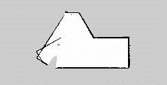

# M2WR-SLAM-ROS

## TASKS DONE

<ul>
  <li>M2WR URDF WAS TAKEN</li>
  <li>Lidar sensor plugins and joints were added</li>
  <li>Obstacle Avoidance code for autonomous mapping of the world was scripted</li>
  <li>Launch files for launching in Gazebo and RViz environment was written</li>
  <li>GMapping code was customized based on M2WR links and joints</li>
  <li>Thus, launched and visualized using ROS; then obstacle avoidance code is called</li>
  <li>Then map has to be saved</li>
  <li>AMCL is used to navigate in the mapped environment</li>
</ul>
  

To understand the basic URDF M2WR robot, refer https://www.theconstructsim.com/ros-projects-exploring-ros-using-2-wheeled-robot-part-1/

To make new world in particular a room in this case, go to Building Editor -> Create using the tools in the left widget box -> Save the world -> Exit. To learn more about building in Gazebo, refer http://gazebosim.org/tutorials?cat=build_world&tut=building_editor

SLAM Gmapping was tried here with the custom world. The map can be viewed in the map folder. 

## MAP OF CUSTOM WORLD

